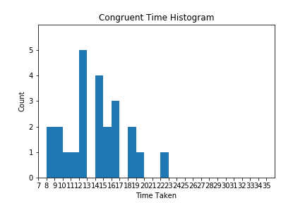
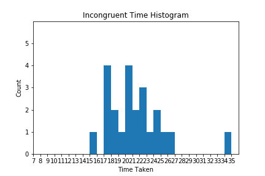
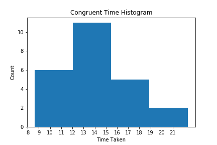
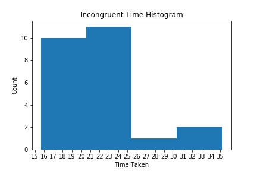
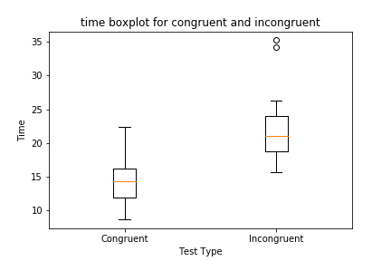

# Test a Perpetual Phenomenon using Hypothesis Testing

# Table of Contents

- [Project Description](#project-description)
  * [What is Stroop effect](#what-is-stroop-effect)
  * [Claim of Stroop effect](#claim-of-stroop-effect)
- [Environment and Programming Language](#environment-and-programming-language)
- [Data Description](#data-description)
  * [Type of Variables](#type-of-variables)
- [Exploratory Data analysis](#exploratory-data-analysis)
  * [Data reading](#data-reading)
  * [Data Analysis](#data-analysis)
  * [Data Visualization](#data-visualization)
- [Hypothesis Testing](#hypothesis-testing)
  * [Hypothesis Creation](#hypothesis-creation)
  * [Hypothesis Parameter Calculation](#hypothesis-parameter-calculation)
  * [Hypothesis testing parameter explanation](#hypothesis-testing-parameter-explanation)
  * [Hypothesis testing Parameters](#hypothesis-testing-parameters)
- [Conclusion](#conclusion)
  * [Reason of this Effect](#reason-of-this-effect)

## Project Description

This project will analyze the claim of Stroop effect.

### What is Stroop effect

  In a Stroop task, participants are presented with a list of words, with each word displayed in a color of ink. The participant’s task is to say out loud the color of the ink in which the word is printed. The task has two conditions: a congruent words condition, and an incongruent words condition.

  1. **Congruent words condition:** The words being displayed are color words whose names match the colors in which they are printed: for example RED(in Red font color), BLUE(in Blue font color).

  2. **Incongruent words condition:** The words displayed are color words whose names do not match the colors in which they are printed: for example PURPLE(not In Purple font color), ORANGE(not in Orange font color).

  In each case, we measure the time it takes to name the ink colors in equally-sized lists. Each participant will go through and record a time from each condition.

### Claim of Stroop effect

  **[Stroop effect](https://en.wikipedia.org/wiki/Stroop_effect) claims that person usually takes higher time in name the ink color in Incongruent scenario as compared to Congruent scenario**.

## Environment and Programming Language

* Python 2.7.14 has been used.
* Miniconda framework has been used which can be downloaded from this [link](https://repo.continuum.io/miniconda/).
* Once installed, open conda prompt.
* Create virtual environment by using `conda env create -f environment.yaml`. **environment.yaml** has been included in the repository.
* Jupyter notebook has been used for interactively working on the problem statement.
* Python code and calculation given in the [Project_2.ipynb](./Project_2.ipynb) file.

## Data Description

  [Data Set](https://www.google.com/url?q=https://drive.google.com/file/d/0B9Yf01UaIbUgQXpYb2NhZ29yX1U/view?usp%3Dsharing&sa=D&ust=1515913787649000&usg=AFQjCNF-f2PgaUNm8VNJtVqVHr6ZEntcgA) contains 25 persons who has taken both of these tests, that is, Congruent and Incongruent word conditions and time has been recorded which is given in the data for each person.

### Type of Variables
  1. **Dependent Variable:** Dependent variable is time taken by each person in naming the ink colors for words.
  2. **Independent Variable:** Independent variable is type of test, that is, **Congruent or Incongruent word conditions**.

## Exploratory Data analysis

Data exploration will not use any advance function for calculation various statistics like mean, median, etc.

Data exploration involves following steps:

### Data reading

Data has been saved in a CSV(Comma Separated Values) format. File have 2 columns: One for Congruent test and other one is for incongruent test.

Function `read_values(filename)` takes the filename as input and return 2 lists containing congruent test and incongruent test results. This function utilizes **DictReader()** function from **csv** library. **DictReader()** reads file line by line.

### Data Analysis

Following helper function are used to calculate various statistics:

  * Function `average_value(list_name)`: This function takes the list name as input and returns **average and sample_size**.

  * Function `median_value(list_name)`: This function takes the list name as input and returns **median**.

  * Function `sample_variance_stddev(list_name)`: This function takes the list name as input and returns **variance and stddev** for the sample.

Following are the formula for various statistics and parameters. Parameters are for the population and statistics are for the sample. Parameters and statistics includes mean, median, variance, standard deviation, etc. for population and samples respectively.

  * **Population Parameters:** Following are the mean, variance and standard deviation of the population.

  

  

  

  * **Sample Statistics:** Following are the mean, variance and standard deviation of a sample.

  

  

  

  

Sampling is the process of taking random samples of size n from the population of size N. Sample standard deviation tends to underestimate the Population standard deviation so we use (n-1) instead of n to calculate the sample standard deviation.

### Data Visualization

As a part of data visualization histograms were plotted for congruent and incongruent tests. Histograms were plotted with bin size = 1 and also with total number of bins = 4 because with bin size = 1, histogram was not proper.

Following are the graphs plotted.

Boxplots of both the tests were also plotted to see any difference. Following is the boxplot.

  * We can see that there are 2 outliers in the incongruent test.
  * We can clearly see incongruent test observation are having higher values for median, first and third quartile as compared to congruent test.

We want to test how significant the difference between time taken for congruent and incongruent test.

## Hypothesis Testing

We need to use t-test for the hypothesis testing. Following are the justifications:

  1. We don't have population mean and standard deviation available. So we cant perform z-test on the samples.

  2. Two different tests were performed on same sample. So this is two conditions example in which we are applying two different condition on same sample. So we need to use dependent sample t-test.

  3. We will perform positive-tailed test for this problem.

### Hypothesis Creation

<a href="https://www.codecogs.com/eqnedit.php?latex=H_a&space;=&space;Alternative\&space;Hypothesis&space;=&space;\mu_{incogruent}&space;>&space;\mu_{congruent}" target="_blank">&space;\mu_{congruent}" title="H_a = Alternative\ Hypothesis = \mu_{incogruent} > \mu_{congruent}" /></a>

**where**

We will do t-test with 95% and 99% confidence interval. We have following parameters available for t_test.

### Hypothesis Parameter Calculation

We have following helper functions to calculate various parameters for the calculation of t-statistics.

  * Function `difference_list(test_1, test_2)`: This function takes 2 tests results and returns the **diff** which is difference between test results for each individual subject.

  * Function `std_error(diff_stddev, sample_size)`: This function takes standard deviation of the difference and sample_size and returns the standard error.

  * Function `t_stats(point_estimate, standard_error)`: This function takes the point estimate and standard error and returns the t-stats value.

  * Function `confidence_interval_value`: This function takes point_estimate, t_critical value and standar_error and returns confidence interval in (lower_bound, upper_bound) tuple

  * Function `cohen_d_value(point_estimate, standard_deviation)`: This function takes point_estimate and standard deviation and returns Cohen's D value.

  * Function `r_squared_value(t_statistics, degree_of_freedom)`: This function takes calculated t_statistics value and degree of freedom and returns r-squared value.

  * Function `margin_of_error_value(t_critical, standard_error)`: This function take t_critical and standard value and returns margin_of_error.

### Hypothesis testing parameter explanation

### Hypothesis testing Parameters

  * Degree of freedom is 23.
  * Standard deviation & variance of difference is 4.864826910359054 & 23.66654086775362 and point estimate is 7.964791666666664.
  * Standard Error for the sample is 0.9930286347783402
  * t-statistics for the sample is 8.020706944109957
  * confidence interval for 95% is (5.910215421310278, 10.01936791202305)
  * confidence interval for 99% is (5.177360288843863, 10.752223044489465)
  * margin of error for 95% is 2.054576245356386
  * margin of error for 99% is 2.787431377822801
  * Conhen's D is 1.6372199491222625
  * r-squared value is 0.736636416144506. So 73.66% variance was explained by Stroop's effect.

Cohen's D is the effect size used to indicate the standardized difference between two means. Following is the Cohen's D value interpretation:

Refernce: [Wikipedia page](https://en.wikipedia.org/wiki/Effect_size#Cohen's_d)

| Effect Size  | Value |
| ------------| ----- |
| Very Small  | 0.01  |
| Small  | 0.20  |
| Medium | 0.50 |
| Large | 0.80 |
| Very Large | 1.20 |
| Huge | 2.0 |

## Conclusion

From the calculation of the various values calculated during hypothesis testing in previous section, following is the conclusion:

**t-test critical levels for 95% confidence interval for degree of freedom = 23**
This is positive tailed test so we will look for 0.05 in t table with degree of freedom as 23. **So t-test critical value is 1.714**.

**t-test critical levels for 99% confidence interval for degree of freedom = 23**
This is positive tailed test so we will look for 0.01 in t table with degree of freedom as 23. **So t-test critical value is 2.500**.

**t-statistics for the sample is 8.020706944109957 which is way higher than t-critical values for 95% and 99% confidence intervals which denotes that incongruent test time is significantly higher than that of congruent test result**.

### Reason of this Effect

Incongruence of word and font color caused confusion in the brain which ultimately caused delay in the processing at brain which ultimately resulted in more time in naming the ink/font color.
